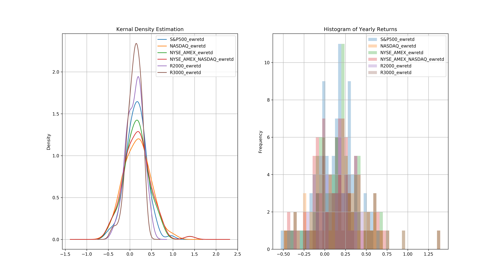
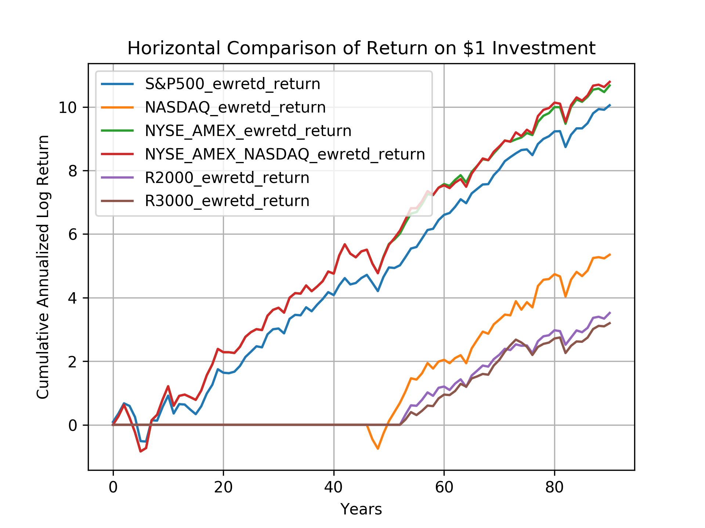

# Benchmark-Analysis

# Introduction
## Compound Annual Growth Rate
CAGR, Compound Annual Growth Rate, is the mean annual growth rate of an investment over a specified period of
time. Rather than a true return rate, it is a representative figure that describes the return rate in the case where an
investment has grown at a steady rate over a period of time, which rarely happens in reality. To calculate the CAGR
over a specific period of time, we divide the ending value of an investment by its original value at the beginning of
that period. Then we take the Nth root of that figure and subtract 1 from the subsequent result, where N represents
the period length in years.

# Results

